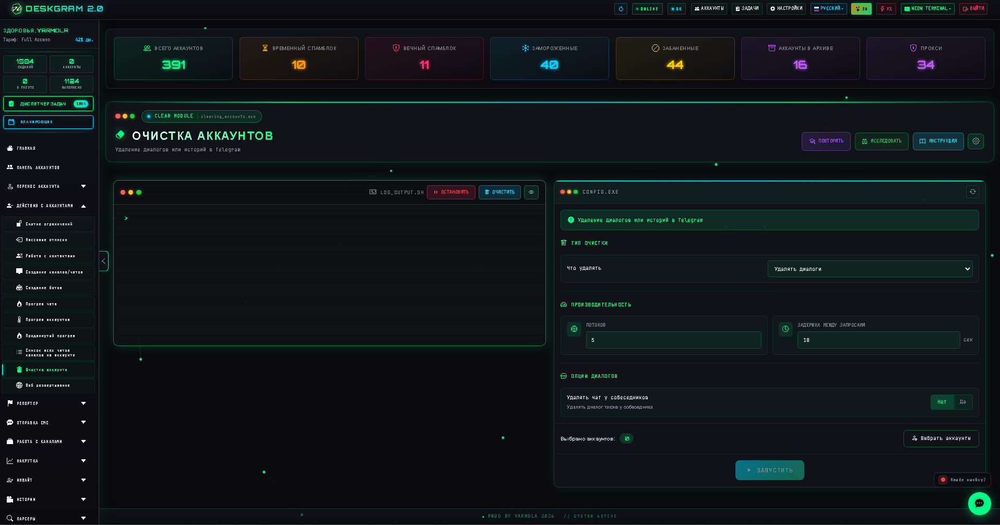
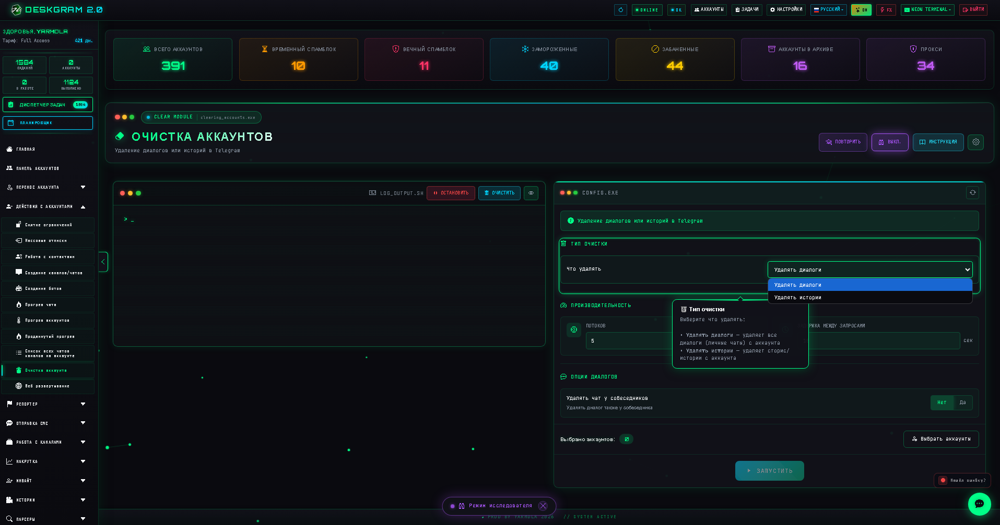
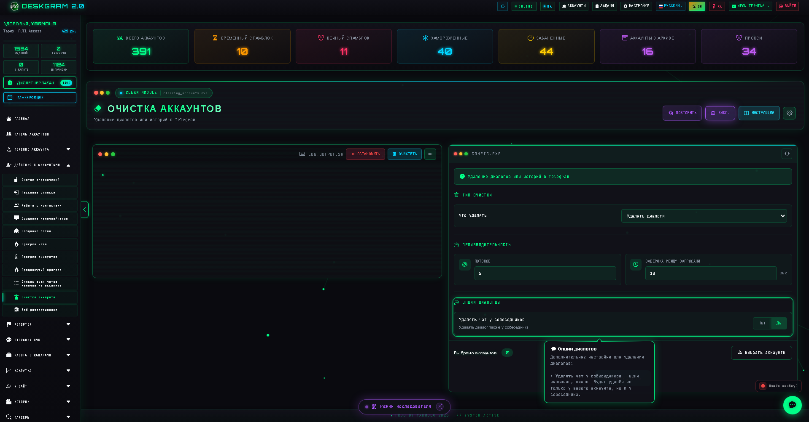
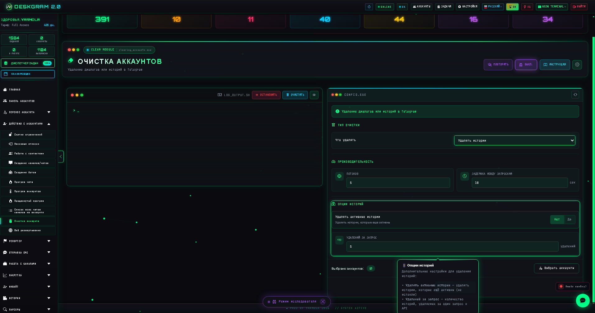

# Очистка Telegram-аккаунтов в Deskgram 2

Очистка аккаунтов в Deskgram 2 помогает убрать диалоги, stories-следы и другой накопившийся служебный мусор, который мешает держать сетку Telegram-аккаунтов в порядке. Этот модуль полезен перед прогревом, сменой сценария работы и регулярным техобслуживанием инфраструктуры.

[Главный хаб Deskgram 2](https://github.com/Deskgram-2/deskgram-2-telegram-automation) · [Сайт](https://deskgram2.com/) · [Telegram-бот](https://t.me/DG2welcomebot) · [Web preview](https://deskgram2.com/web-preview?path=%2Fapp-demo%2F&lang=ru)

## Интерактивный Web Preview

Попробовать модуль в браузере: [Открыть веб-превью](https://deskgram2.com/web-preview?path=%2Fapp-demo%2Ffunctions%2Fclearing_accounts&lang=ru)

Так проще заранее посмотреть, какие типы очистки доступны и как устроены настройки диалогов, stories и лимитов.

## Скриншоты

## Кратко о модуле

| Параметр | Что внутри |
|---|---|
| Основная задача | Очистка Telegram-аккаунтов от диалогов, историй и служебных хвостов |
| Важные блоки | Тип очистки, параметры производительности, лог, настройки диалогов и stories |
| Полезен для | Поддержания чистой инфраструктуры, подготовки к новому сценарию, обслуживания сетки |
| Связанные модули | Панель аккаунтов, Диспетчер задач, Прогрев аккаунтов, Массовые отписки |

## Что умеет модуль

- запускать очистку по выбранным аккаунтам;
- разделять типы очистки по сценариям;
- отдельно управлять очисткой диалогов и stories;
- показывать лог и рабочие параметры в одном экране;
- помогать возвращать инфраструктуру к чистому состоянию.

## Быстрый старт

1. Выберите тип очистки.
2. Настройте параметры диалогов и stories.
3. Задайте рабочий темп и ограничения.
4. Выберите аккаунты и запустите задачу.
5. После завершения используйте очищенные аккаунты в следующем сценарии.

## С чем лучше сочетать

- [Панель аккаунтов](https://github.com/Deskgram-2/telegram-account-manager-deskgram), если сначала нужно собрать выборку под очистку.
- [Диспетчер задач](https://github.com/Deskgram-2/telegram-task-manager-deskgram), если обслуживание инфраструктуры идет как часть большого операционного потока.
- [Прогрев аккаунтов](https://github.com/Deskgram-2/telegram-account-warmup-deskgram), если после очистки планируется мягкий возврат в активную работу.
- [Массовые отписки](https://github.com/Deskgram-2/telegram-leave-groups-deskgram), если кроме внутренней очистки нужно еще убрать лишнюю внешнюю среду.

## Когда особенно полезен

- когда аккаунты долго работали без обслуживания;
- когда перед новым сценарием нужно убрать следы старой активности;
- когда требуется стандартный maintenance-pass для всей сетки;
- когда ручная очистка по аккаунтам уже отнимает слишком много времени.

## Сценарии применения

### Сценарий 1. Плановое обслуживание инфраструктуры

Очистка аккаунтов помогает возвращать сетку в аккуратное состояние между рабочими циклами и не накапливать мусор в интерфейсе и истории действий.

### Сценарий 2. Подготовка к смене сценария

Если аккаунты использовались для одного use-case, а теперь уходят в другой, очистка помогает сделать переход чище и спокойнее.

### Сценарий 3. Слой перед прогревом

После очистки проще запускать [прогрев аккаунтов](https://github.com/Deskgram-2/telegram-account-warmup-deskgram), потому что среда уже не захламлена прошлой активностью.

## Что выбрать: очистку аккаунтов или массовые отписки

| Если задача такая | Лучше использовать |
|---|---|
| Нужно убрать внутренние следы активности в аккаунте | [Очистка аккаунтов](https://github.com/Deskgram-2/telegram-account-cleanup-deskgram) |
| Нужно вывести аккаунты из внешней среды: каналов и групп | [Массовые отписки](https://github.com/Deskgram-2/telegram-leave-groups-deskgram) |
| Нужен полный maintenance-pass | Сначала отписки, потом очистка аккаунтов |
| Нужен только порядок внутри интерфейса аккаунтов | Очистка аккаунтов |

## Смежные репозитории

- [Главный хаб Deskgram 2](https://github.com/Deskgram-2/deskgram-2-telegram-automation)
- [Панель аккаунтов](https://github.com/Deskgram-2/telegram-account-manager-deskgram)
- [Диспетчер задач](https://github.com/Deskgram-2/telegram-task-manager-deskgram)
- [Прогрев аккаунтов](https://github.com/Deskgram-2/telegram-account-warmup-deskgram)
- [Массовые отписки](https://github.com/Deskgram-2/telegram-leave-groups-deskgram)
- [Настройки](https://github.com/Deskgram-2/telegram-automation-settings-deskgram)

## FAQ

### Можно ли посмотреть модуль до установки?

Да. Веб-превью позволяет открыть интерфейс прямо в браузере и заранее оценить, подходит ли вам такой maintenance-сценарий.

### Этот модуль удаляет аккаунты из системы?

Нет. Его задача не удалять аккаунты из базы, а очищать их рабочую среду и внутренние следы активности.

### Когда очистку лучше делать вместе с прогревом?

Когда вы хотите не просто убрать старые хвосты, а сразу вернуть аккаунты в более живое и стабильное рабочее состояние через [прогрев аккаунтов](https://github.com/Deskgram-2/telegram-account-warmup-deskgram).
